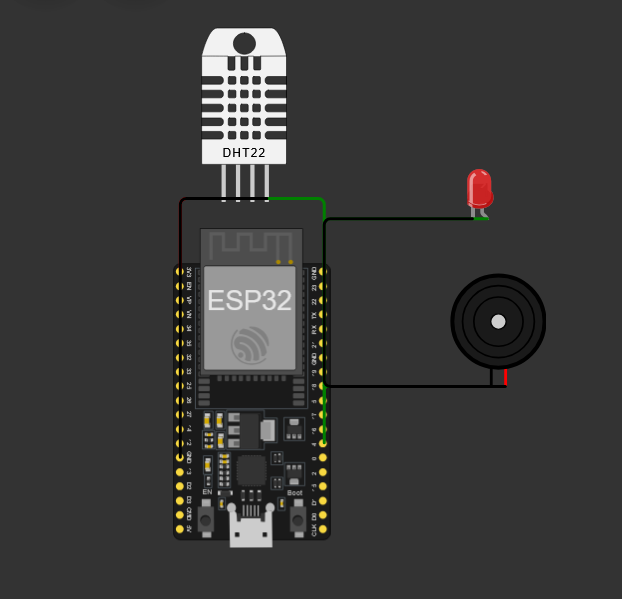
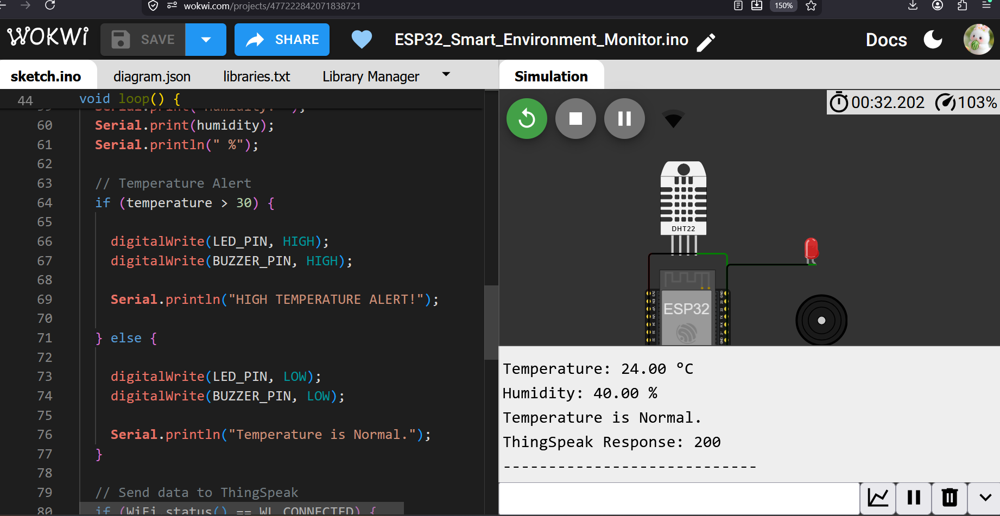
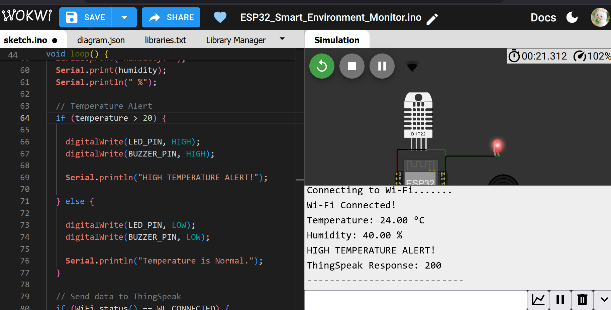
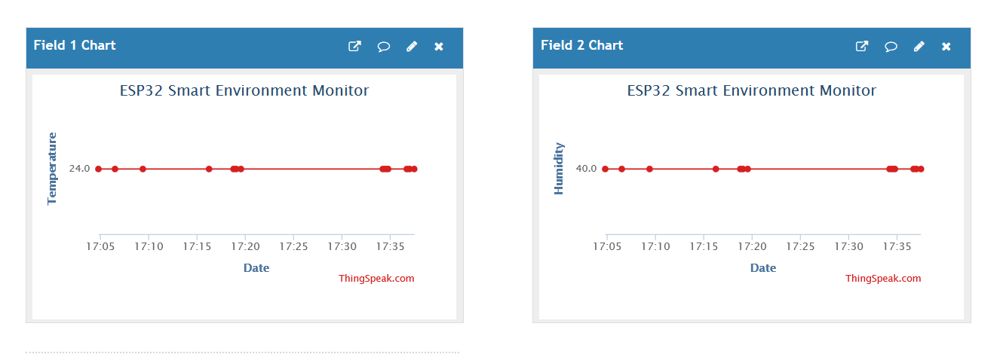

# 🌡️ ESP32 Smart Environment Monitoring & Alert System

An IoT-based environment monitoring system built using **ESP32, DHT22, Wi-Fi and ThingSpeak**. The system measures temperature and humidity, sends the data to the cloud, displays real-time graphs, and provides a local alert using an LED and buzzer when the temperature exceeds the defined threshold.

## 📌 Project Overview

This project demonstrates how an ESP32 can be used to collect environmental data from a DHT22 sensor and transmit it to the **ThingSpeak IoT cloud platform** over Wi-Fi.

The system also includes a temperature-based alert mechanism:

**Temperature > 30°C → LED ON + Buzzer ON**

The complete system was developed and tested using **Wokwi ESP32 simulation**.

## ✨ Features

* 🌡️ Real-time temperature monitoring
* 💧 Real-time humidity monitoring
* 📡 ESP32 Wi-Fi connectivity
* ☁️ ThingSpeak cloud integration
* 📊 Temperature and humidity visualization
* 🔴 High-temperature LED alert
* 🔊 High-temperature buzzer alert
* 🚨 Configurable temperature threshold
* 🖥️ Serial Monitor output
* 🧪 Tested in Wokwi simulation

## 🧰 Components Used

| Component    | Purpose                        |
| ------------ | ------------------------------ |
| ESP32 DevKit | Main microcontroller           |
| DHT22        | Temperature & humidity sensing |
| LED          | Visual alert                   |
| Buzzer       | Audible alert                  |
| ThingSpeak   | Cloud monitoring platform      |
| Wokwi        | Circuit simulation             |

## 🔌 Pin Connections

| Component  | ESP32 Pin |
| ---------- | --------- |
| DHT22 Data | GPIO 4    |
| LED        | GPIO 5    |
| Buzzer     | GPIO 18   |
| DHT22 VCC  | 3.3V      |
| DHT22 GND  | GND       |

## ⚙️ Working Principle

```text
DHT22 Sensor
     ↓
   ESP32
     ↓
  Wi-Fi
     ↓
 ThingSpeak
     ↓
Temperature & Humidity Graphs

Temperature > 30°C
     ↓
 LED ON + Buzzer ON
```

### Working Steps

1. The DHT22 sensor measures temperature and humidity.
2. ESP32 reads the sensor values.
3. ESP32 connects to the Wi-Fi network.
4. The collected data is sent to ThingSpeak.
5. ThingSpeak displays the values as graphs.
6. ESP32 checks the temperature against the threshold.
7. If temperature exceeds **30°C**, the LED and buzzer are activated.
8. Otherwise, the system remains in the normal state.

## 🚨 Alert System

The alert threshold is set to:

```cpp
temperature > 30
```

### Normal Condition

```text
Temperature ≤ 30°C
→ LED OFF
→ Buzzer OFF
```

### Alert Condition

```text
Temperature > 30°C
→ LED ON
→ Buzzer ON
→ HIGH TEMPERATURE ALERT!
```

## ☁️ ThingSpeak Monitoring

The ESP32 sends two parameters to ThingSpeak:

* **Field 1:** Temperature (°C)
* **Field 2:** Humidity (%)

A successful data transmission returns:

```text
ThingSpeak Response: 200
```

## 📸 Project Screenshots

### 🔧 Wokwi Circuit



### 🖥️ Normal Sensor Output



### 🚨 High Temperature Alert Test



### ☁️ ThingSpeak Dashboard



## 🧪 Sample Output

```text
Wi-Fi Connected!

Temperature: 24.00 °C
Humidity: 40.00 %

Temperature is Normal.

ThingSpeak Response: 200
```

During alert testing:

```text
HIGH TEMPERATURE ALERT!
```

The LED and buzzer turn ON when the temperature crosses the configured threshold.

## 🛠️ Technologies Used

* **C++ / Arduino**
* **ESP32**
* **DHT22**
* **Wi-Fi**
* **ThingSpeak**
* **Wokwi**
* **IoT / Embedded Systems**

## 📁 Project Structure

```text
ESP32-Smart-Environment-Monitor/
│
├── ESP32_Smart_Environment_Monitor.ino
├── diagram.json
├── README.md
│
└── images/
    ├── .gitkeep
    ├── wokwi_circuit.png
    ├── normal_output.png
    ├── alert_test.png
    └── Thingspeak_dashboard.png
```

## 🔐 Security Note

The ThingSpeak Write API key is **not included in this repository**.

Replace the placeholder below with your own key when running the project:

```cpp
String apiKey = "YOUR_WRITE_API_KEY";
```

Never publish your private API key publicly.

## 🚀 Future Improvements

* 📱 Mobile notification system
* 🌐 Web-based monitoring dashboard
* 📈 More advanced data visualization
* 🌫️ Air-quality monitoring using additional sensors
* 💾 Local data logging
* 🔔 Multiple configurable alert thresholds
* 🔋 Battery-powered deployment

## 🎯 Learning Outcomes

Through this project, I learned:

* ESP32 programming
* Sensor interfacing
* DHT22 temperature and humidity sensing
* Wi-Fi communication
* Cloud-based IoT monitoring
* ThingSpeak integration
* GPIO-based alert systems
* Basic IoT system architecture
* Wokwi-based embedded simulation

---

### 👩‍💻 Author

**Tanisha Karan**

B.Tech — Computer Science / Internet of Things

> Building my journey from basic embedded systems to advanced IoT engineering. 🚀
